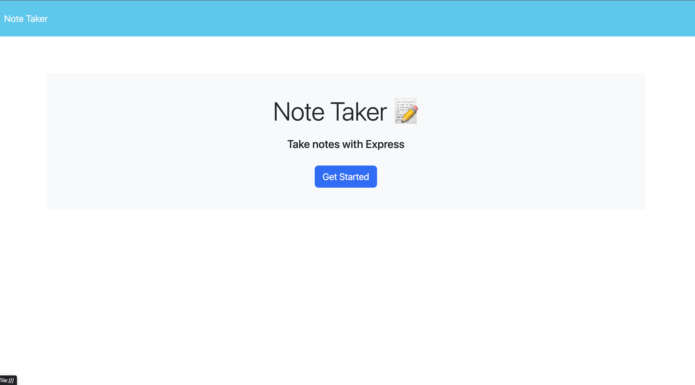

# Note Taker

The purpose of the note taker is to be able to take notes, sorting through to do lists, reminders, or affirmations of the day.

## Process

Using Express and building servers to keep the notes stored

## Why was it created?

Note Taker was created so that people can have an easy place to jot and stores notes. This note taker brings on convience, self reflection, and priortizes our day to day living.

## Image of note taker

